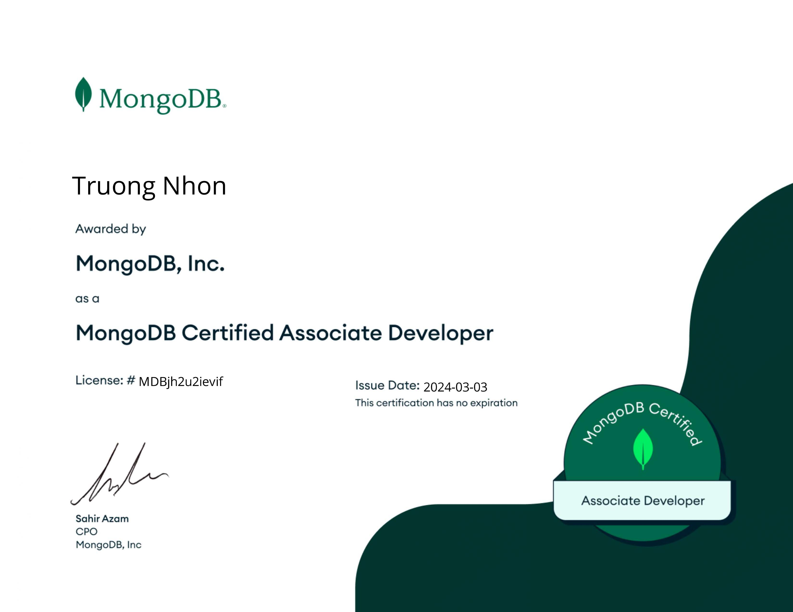
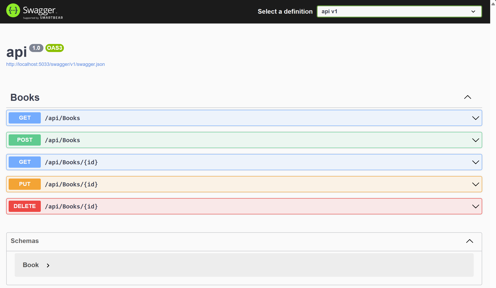

# MongoDB Repository

This repository contains a demonstration of MongoDB integration using the C# driver, along with relevant resources and links.

## Associate developer MongoDB



## MongoDB Demo using C# Driver

### Prerequisites

- Ensure you have MongoDB installed on your machine. If not, you can download it [here](https://www.mongodb.com/try/download/community).
- Install the MongoDB C# driver. You can install it via NuGet Package Manager Console using the following command:

```bash
Install-Package MongoDB.Driver 
```

### Running the Demo

- Clone this repository:

```bash
git clone https://github.com/nhonvo/mongo-note.git
```

- Open the project in your preferred C# development environment.
- Update the MongoDB connection string in the `appsettings.json` file with your MongoDB server details.
- Run the application to see the MongoDB C# driver in action.
- 


## Reference Resources

- [Mongo with Csharp](https://nhonvo.github.io/2024/03/01/mongo-with-csharp/)
- [Mongodb theory and examples code](https://nhonvo.github.io/2024/02/15/mongodb-theory-and-examples-code/)
- [Exploring MongoDB and mongosh in Bash](https://nhonvo.github.io/2024/01/01/Exploring-MongoDB-and-mongosh-in-Bash-Senior-note/)
